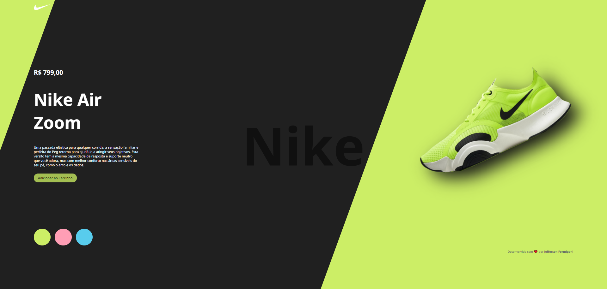
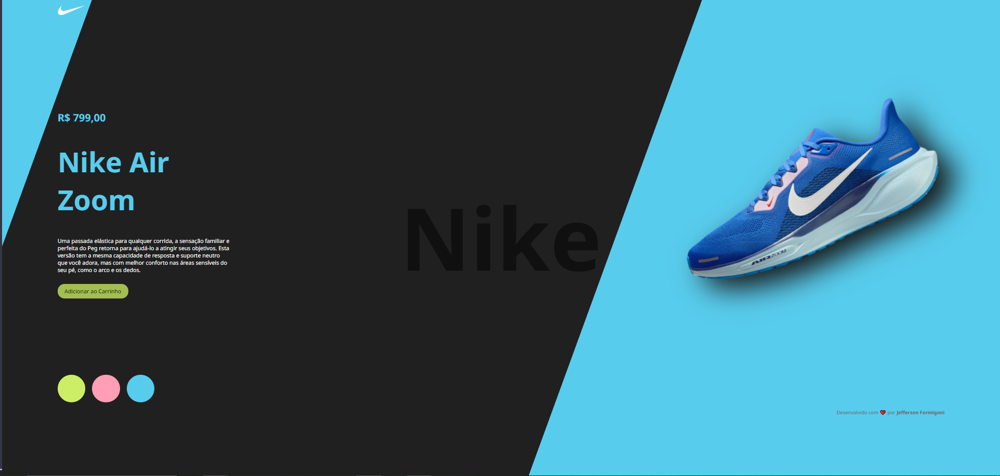

# Projeto Nike - Página de Produto 👟

Este é um projeto front-end de uma página de destaque para o tênis **Nike Air Zoom**, desenvolvido com **HTML**, **CSS** e **JavaScript** puro. A proposta é simular uma vitrine interativa onde o usuário pode alterar o visual do site e ver diferentes versões do produto.

---

## ✨ Funcionalidades

- 🖼️ Troca de cor de fundo e do modelo do tênis com apenas um clique
- 🔁 Animação suave ao trocar o tênis
- 💬 Informações do produto com botão "Adicionar ao Carrinho"
- 🎨 Design moderno com destaque na tipografia e cores
- 📱 Layout responsivo com `flexbox`
- 🧠 Sem frameworks ou bibliotecas — tudo feito na mão

---

## 🛠️ Tecnologias utilizadas

- **HTML5**  
- **CSS3** (com uso de `before`, `after`, sombras e efeitos visuais)  
- **JavaScript** (manipulação de DOM, efeitos de transição)  
- **Google Fonts** (Noto Sans)

---

## 📂 Estrutura de Arquivos

```
projeto-nike/
│
├── index.html          # Página principal
├── styles.css          # Estilos do site
├── scripts.js          # Lógica JavaScript
└── img/
    ├── logo.png
    ├── nike1.png
    ├── nike2.png
    └── nike3.png
```

---

## 🚀 Como executar

1. Faça o download ou clone este repositório.
2. Abra o arquivo `index.html` em qualquer navegador moderno.
3. Clique nos botões coloridos para mudar a aparência do site.

---

## 🎨 Paleta de Cores

| Nome  | Cor HEX     |
|-------|-------------|
| Verde | `#ccee66`   |
| Rosa  | `#ff9eb5`   |
| Azul  | `#58cced`   |

---

> ## 📸 Captura de Tela

### Versão Verde


### Versão Rosa


### Versão Azul


---

## 👤 Autor

Desenvolvido com ❤️ por **Jefferson Formigoni**  
[GitHub](https://github.com/seuusuario) • [LinkedIn](https://linkedin.com/in/seuperfil)

---

## 📄 Licença

Este projeto é livre para estudos e uso pessoal. Sinta-se à vontade para melhorar ou adaptar!